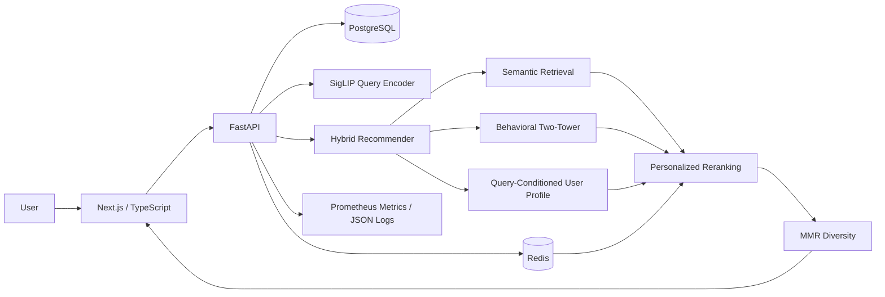

# InspireRank

**A production-style multimodal recommendation and visual-discovery system.**

InspireRank combines pretrained semantic representations, behavioral learning,
real-time feedback, personalized search, diversity reranking, and production
observability in one end-to-end system.

> Public demo: add the deployment URL here after Milestone 16 deployment.

## What it does

Users can browse a personalized feed, like/save/hide items and see the feed
adapt immediately, and search with natural-language queries whose rankings are
personalized to historical and recent interests.

Amazon Reviews 2023 provides the public interaction/catalog data used for
reproducible experiments; InspireRank itself is built as a general discovery
and recommendation platform.

## Architecture



## Dataset

Experiments use a reproducible subset of the Amazon Reviews 2023
**Arts, Crafts & Sewing** 5-core benchmark.

| Metric | Value |
|---|---:|
| Users | 5,000 |
| Catalog items | 27,206 |
| Training interactions | 34,886 |
| Validation interactions | 5,000 |
| Test interactions | 5,000 |
| Catalog text coverage | 100% |
| Catalog image coverage | 99.95% |

## Recommendation results

| Model | Test Recall@20 |
|---|---:|
| Popularity baseline | 0.0114 |
| SigLIP text-content baseline | 0.0336 |
| Hybrid semantic + behavioral | **0.0444** |

The hybrid system improved Recall@20 by **32.1% relative to the semantic
content baseline** and by about **3.9× over popularity**.

## Personalized semantic search

Search uses pure semantic retrieval for the top candidate pool, then
query-conditioned history, global taste, Redis feedback, behavioral confidence,
and MMR diversity reranking.

Measured across four demo users:

| Query | overlap@5 | overlap@20 |
|---|---:|---:|
| `craft supplies` | 56.7% | 75.8% |
| `origami paper with Japanese patterns` | 100.0% | 92.5% |

Broad queries vary more by user; precise queries preserve explicit intent.

## Performance

Local CPU evaluation:

| Metric | Result |
|---|---:|
| Search p50 | 83.75 ms |
| Search p95 | 92.81 ms |
| Mean query encoding stage | 73.06 ms |
| Mean candidate retrieval stage | 3.88 ms |
| Mean personalized reranking stage | 0.94 ms |
| Mean MMR stage | 2.74 ms |

A bounded query-embedding cache targets the main bottleneck.

| Query-encoding path | Latency |
|---|---:|
| Uncached SigLIP query | 86.03 ms |
| Cached mean | **0.017 ms** |
| Cached p95 | **0.025 ms** |

These cache figures describe the **query-encoding stage**, not end-to-end
search latency.

## Catalog quality

A catalog audit exposed that the first ASCII-only filter incorrectly rejected
a valid Japanese origami title. The final Unicode-aware conservative filter
retained 27,203 of 27,206 catalog items (**99.99%**) and includes regression
tests for multilingual and malformed titles.

## Stack

**Frontend:** Next.js, React, TypeScript  
**Backend / ML:** FastAPI, PyTorch, Hugging Face Transformers, SigLIP  
**Data:** PostgreSQL, pgvector, Redis  
**Production:** Docker, Docker Compose, Caddy, health checks, structured JSON
logs, Prometheus-compatible metrics, GitHub Actions CI

## Observability

The API exposes:

```text
GET /health/live
GET /health/ready
GET /metrics
GET /api/v1/diagnostics/catalog-quality
GET /api/v1/diagnostics/query-cache
```

Every response includes `X-Request-ID` and
`X-InspireRank-Process-Time-Ms`.

## Key engineering decisions

**Hybrid retrieval:** behavioral learning improved warm retrieval but hurt
zero-shot generalization, so pretrained semantics remain the catalog-wide base
signal and behavior is added only where support is reliable.

**Redis + PostgreSQL:** PostgreSQL is the permanent event log; Redis provides
fast short-term preference state and is not the source of truth.

**One model-loaded worker per container:** multiple Python workers would
duplicate large ML models in memory, so scale-out should use multiple
containers rather than multiple workers inside one container.

**MMR diversity:** relevance-only ranking can return near-duplicates, so MMR
balances relevance and discovery diversity.

## Repository layout

```text
apps/api/        FastAPI + ML/recommendation services
apps/web/        Next.js frontend
artifacts/       learned weights + catalog embeddings
data/            reproducible recommendation dataset
deploy/          public deployment configuration
infra/           PostgreSQL initialization
```

## Status

Recommendation, semantic search, real-time personalization, evaluation,
observability, and a production-style local Docker stack are complete.
The final release step is a public HTTPS deployment.
